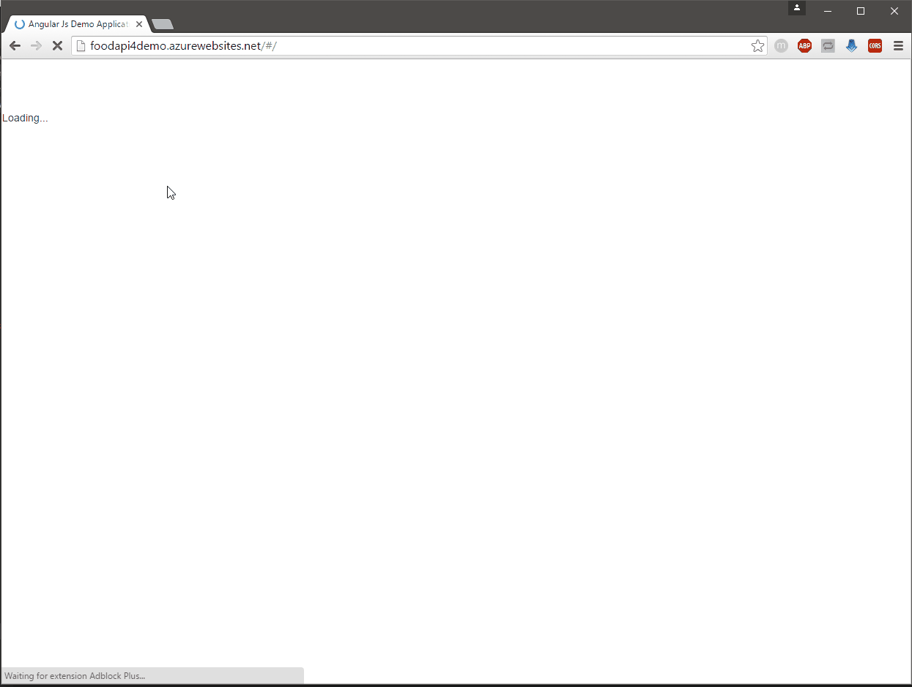
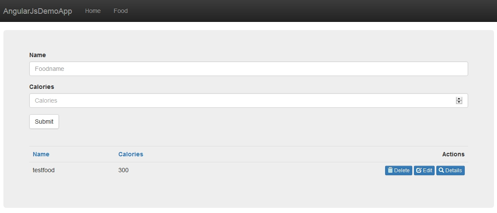

# ASP.NET / ASP.NET Core WebAPI AngularJS / Angular Demo with Webpack Ahead-of-Time (Aot) Compilation, Lazy Loading and Treeshaking

This repository offers you one demo application implemented three times (AngularJS, Angular with SystemJS and Angular with Webpack) with two compatible endpoints implemented in ASP.NET & ASP.NET Core.

The application comes with forms, custom validation, routing etc.

Server and Client are completely seperated that you can exchange the endpoint easily.

### Check the corresponding package.json for the npm commands to start the repository

## AngularJS Client (Folder: "Angular1-Client")

This client is implemented with component based design and the one-way dataflow. It is using gulp as a taskrunner to minify and uglify the javascript files. By running 

```npm install```

and 

```npm start```

the application starts and runs in your default browser.

By typing 

```npm run buildProd```

the application build in a ".dist"-folder and you can then type 

```npm run liteProd```

to serve the files from the ".dist"-folder.

## Angular Client with SystemJS (Folder: "Angular2-Client")

This client is implemented with Angular and SystemJS. You can start the application by running

```npm install```

and 

```npm start```

the application starts and runs in your default browser.

Here also gulp is used to build an minified application in a ".dist"-folder.

By typing 

```npm run dist```

the application build in a ".dist"-folder and you can then type 

```npm run liteDist```

to serve the files from the ".dist"-folder.

## Angular Client with Webpack, Treeshaking and Ahead of Time (Aot) Compilation (Folder: "Angular2-Client-Webpack")

This client is implemented with Angular and Webpack. You can start the application by running

```npm install```

and 

```npm start```

the application starts and runs in your default browser.

By typing 

```npm run webpack-dev```

the application is build without treeshaking and AoT in a dist/jit folder.

If you type

```npm run webpack-prod```

the application is build with treeshaking and AoT in a dist/aot folder.

If you want to start te application afterwards modify the path in the 

```bs-config.json```

to specify where the files are served from.

## Demo

You can see an AngularJS Demo with all the techniques combined here (running on Azure)

[Demo](http://foodapi4demo.azurewebsites.net/)



## Screens

### Home


### Form

