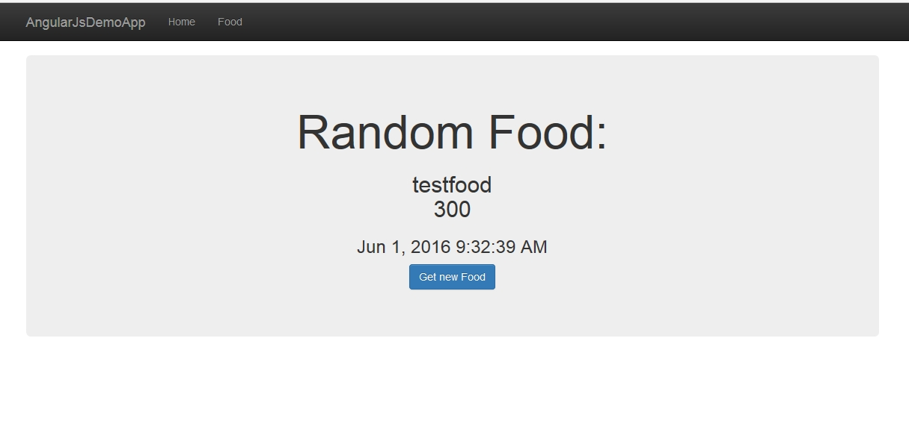

# ASP.NET / ASP.NET Core WebAPI AngularJS / Angular Demo with Ngrx store & Ngrx effects, Component based design & Lazy Loading  runnable on every Platform (Cross Platform)

This repository offers you one demo application implemented two times (AngularJS, AngularCLI) with two compatible endpoints implemented in ASP.NET & ASP.NET Core served to run on every platform (Cross Platform)

The application comes with lazy loading, forms, custom validation, routing , ngrx store, ngrx effects, etc.

Server and Client are completely seperated that you can exchange the endpoint easily.

### Check the corresponding package.json for the npm commands to start the repository

## Prerequisites 

Please install cordova and the trash-cli globally to handle cross platform for the [AngularCLI-Demo](https://github.com/FabianGosebrink/ASPNET-ASPNETCore-Angular-Ngrx/tree/master/AngularCLI)

```npm install cordova -g```

* [XCode](https://developer.apple.com/xcode/download/)
* [Android SDK](https://developer.android.com/sdk/index.html)
* [Windows 10 SDK](https://dev.windows.com/en-us/downloads/windows-10-sdk)

## Angular Client with Webpack, Treeshaking and Ahead of Time (Aot) Compilation (Folder: "AngularCLI")

This client is implemented with Angular and Webpack. You can start the application by running

```npm install```

and 

```npm start```

the application starts and runs in your default browser.

You can build Cross Platform by typing

```npm run build-all```

for building Web, Desktop (Windows and Linux) and Apps for Android and Windows Phone in the .dist folder.

## AngularJS Client (Folder: "AngularJS-Client")

This client is implemented with component based design and the one-way dataflow. It is using gulp as a taskrunner to minify and uglify the javascript files. By running 

```yarn```

and 

```npm start```

the application starts and runs in your default browser.

By typing 

```npm run buildProd```

the application build in a ".dist"-folder and you can then type 

```npm run liteProd```

to serve the files from the ".dist"-folder.


# Demo

You can see an Angular Demo with all the techniques combined here (running on Azure)

## Frontend

[http://foodapiui.azurewebsites.net/](http://foodapiui.azurewebsites.net/)

## Backend
[http://foodapi4demo.azurewebsites.net/](http://foodapi4demo.azurewebsites.net/)


## Screens

### Home



### Form

