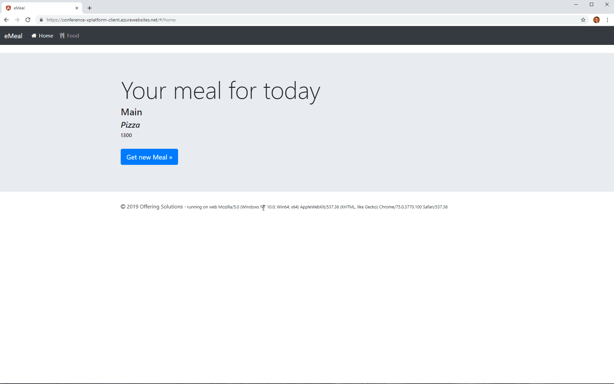

# ASP.NET Core WebAPI with SignalR & Angular Demo with NgRx store & NgRx effects, Component based design (Cross Platform)

  

This repository offers you a demo application implemented with the AngularCLI and an endpoint using ASP.NET Core WebAPI.

The application comes with lazy loading, forms, custom validation, routing, NgRx store, NgRx effects, facade pattern etc.

Server and Client are completely seperated that you can exchange the endpoint easily.

### Check the corresponding package.json for the npm commands to start the repository

# Demo

You can see an Angular Demo with all the techniques combined here (running on Azure)

## Frontend

[https://conference-xplatform-client.azurewebsites.net](https://conference-xplatform-client.azurewebsites.net/)

## Backend

[https://conference-xplatform-server.azurewebsites.net](https://conference-xplatform-server.azurewebsites.net/)

## Author

👤 **Fabian Gosebrink**

- Twitter: [@FabianGosebrink](https://twitter.com/FabianGosebrink)
- Github: [@FabianGosebrink](https://github.com/FabianGosebrink)

## Prerequisites

- [Android SDK](https://developer.android.com/sdk/index.html)
- [Windows 10 SDK](https://dev.windows.com/en-us/downloads/windows-10-sdk)
- Download and install [ImageMagick](http://www.imagemagick.org/script/download.php) (base toolkit for image processing, used here for splash screen and icon generation)

## Angular Client

This client is implemented with Angular. You can start the application by running

`npm install`

and

`npm start`

the application starts and runs in your default browser.

### Build Web

use the `npm run build-web` command and see the `.dist/web` folder.

### Build Mobile

use the `npm run build-mobile` command and see the `.dist/mobile` folder.

### Build Desktop

use the `npm run build-desktop` command and see the `.dist/desktop` folder.

### Build Web, Desktop and Mobile

`npm run build-all`

for building Web, Desktop (Windows and Linux) and Apps for Android in the `.dist` folder.

## Show your support

Give a ⭐️ if this project helped you!
